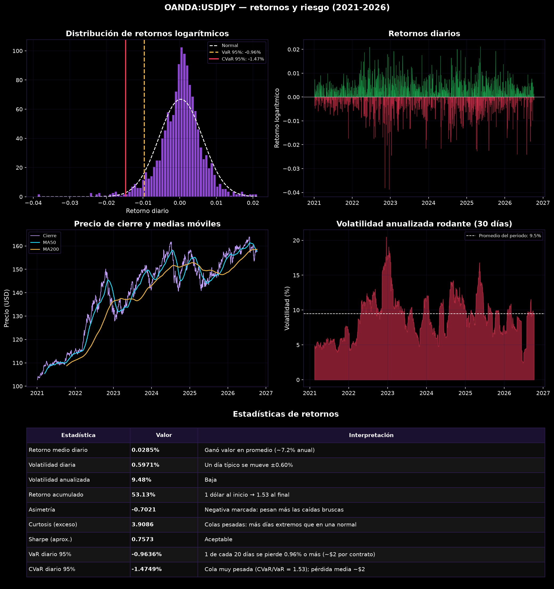
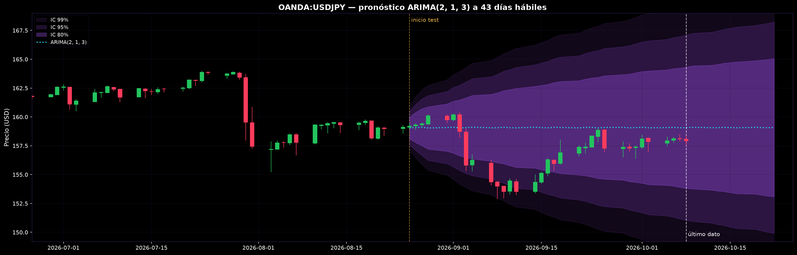
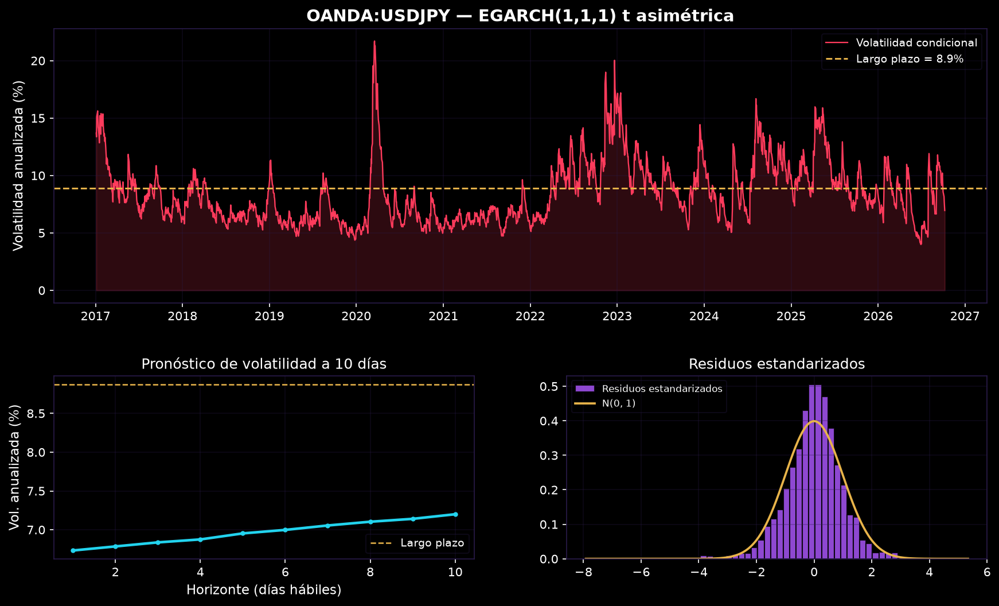
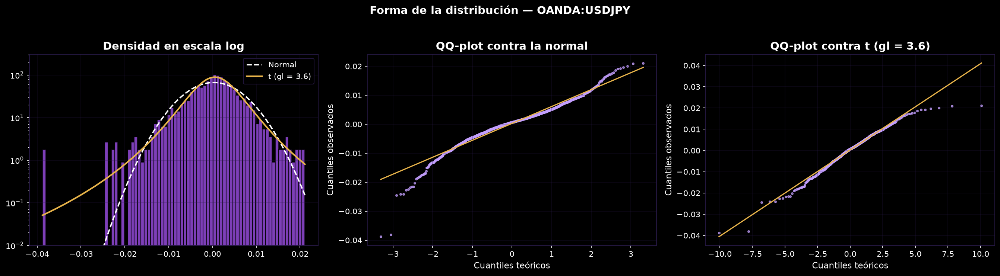

# Series de tiempo en futuros: oro y Nasdaq

Análisis de los micro futuros de oro (`MGC=F`) y Nasdaq 100 (`MNQ=F`) con datos diarios de Yahoo Finance o TradingView. La idea es pasar por las herramientas clásicas de series de tiempo financieras y ver qué dice cada una sobre estos dos contratos: qué tan riesgosos son, si el precio se puede pronosticar, cómo se comporta la volatilidad y si un activo le dice algo al otro.



## Qué hay en el análisis

| Sección | Qué se hace |
|---|---|
| Limpieza | Duplicados, nulos sin look-ahead y marcado de retornos atípicos con z-score robusto (MAD) |
| Retornos y riesgo | Volatilidad, asimetría, curtosis, Sharpe, VaR y CVaR en dólares por contrato |
| Distribución | Jarque-Bera, Shapiro-Wilk, ajuste normal vs t de Student, QQ-plots |
| Estacionariedad | ADF + KPSS sobre precio, diferencias, retornos y retornos² |
| ARIMA | Orden por AIC, Ljung-Box, pronóstico con bandas al 80/95/99% sobre velas |
| Evaluación | RMSE, MAE, MAPE, R² y U de Theil contra pronósticos ingenuos; error por horizonte |
| Volatilidad | ARCH-LM, GARCH(1,1) y búsqueda entre GARCH, GJR-GARCH y EGARCH con innovaciones t / t asimétrica |
| VAR | Rezagos por AIC, causalidad de Granger, impulso-respuesta (con chequeo del orden de Cholesky) |

## Algunos resultados

**El precio no se deja pronosticar, la volatilidad sí.** El ARIMA a un paso sigue la serie de cerca y tiene un R² altísimo, pero la U de Theil frente al paseo aleatorio queda alrededor de 1: no aporta nada que no diga el precio de ayer. En cambio, la volatilidad tiene memoria clara (efecto ARCH, clustering) y GARCH la captura bien.





**Las colas son más pesadas que las de una normal.** Hay muchos más días a más de 3σ de los que predice la normal, y la t de Student ajusta mejor por AIC. Un VaR con supuesto normal subestima las pérdidas extremas.



## Estructura

```
├── analisis.ipynb        notebook principal
├── seriesfin/
│   ├── datos.py          descarga (Yahoo / TradingView) y limpieza
│   ├── estadisticas.py   métricas de retorno y riesgo, pruebas de normalidad
│   ├── diagnostico.py    estacionariedad, ACF/PACF, ARCH-LM
│   ├── arima.py          selección, ajuste y pronóstico
│   ├── evaluacion.py     métricas fuera de muestra
│   ├── volatilidad.py    familia GARCH
│   ├── sistema.py        VAR, Granger, impulso-respuesta
│   ├── graficos.py       todas las figuras
│   └── estilo.py         paleta y estilo de matplotlib
└── figuras/              figuras que guarda el notebook
```

## Cómo correrlo

```bash
git clone https://github.com/<tu-usuario>/series-tiempo-futuros.git
cd series-tiempo-futuros
python -m venv .venv && source .venv/bin/activate
pip install -r requirements.txt
jupyter notebook analisis.ipynb
```

Los tickers, fechas y el corte entre entrenamiento y prueba se cambian en la celda de parámetros al inicio del notebook. Para acciones o ETF el multiplicador de contrato es 1.

### Fuente de datos

`FUENTE = 'yahoo'` (por defecto) usa `yfinance`. Con `FUENTE = 'tradingview'` los datos se bajan del websocket de TradingView con un cliente propio (`seriesfin/tradingview.py`), sin depender de librerías no oficiales.

Los tickers se pueden escribir al estilo Yahoo (`MGC=F`, `XAUUSD=X`, `^TNX`) y se traducen con el diccionario `SIMBOLOS_TV` de `seriesfin/datos.py`, o directo como en TradingView: `'COMEX:MGC1!'`, `'OANDA:XAUUSD'`, `'TVC:TNX'`.

```python
from seriesfin import tradingview
df = tradingview.historico('OANDA:XAUUSD', '1D', n_barras=2000)
```

Funciona sin cuenta. Para usar una, se definen las variables de entorno `TV_USUARIO` y `TV_CLAVE` antes de abrir Jupyter (así la clave no queda en el código). TradingView entrega máximo 5000 barras por consulta y no ajusta los ETF por dividendos.

## Limitaciones

- Los futuros continuos de Yahoo y TradingView **no están ajustados por roll**. En cada vencimiento hay un salto de precio que entra como retorno y ensucia un poco ARIMA, GARCH y las colas. La limpieza marca esos días pero no los quita. Para oro sin rolls se puede usar GLD o IAU.
- Los modelos se estiman una vez con el periodo de entrenamiento; no hay re-estimación móvil (walk-forward) ni costos de transacción.
- Es un ejercicio de análisis, no una recomendación de inversión.
